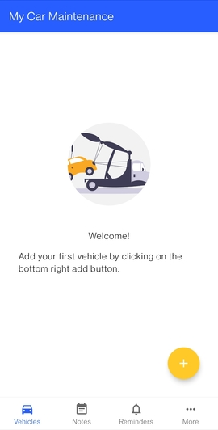
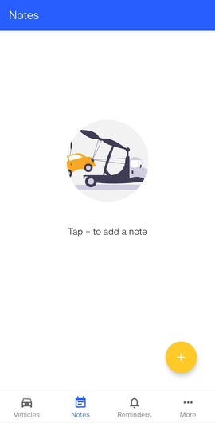
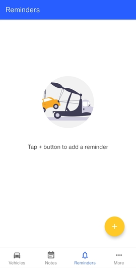
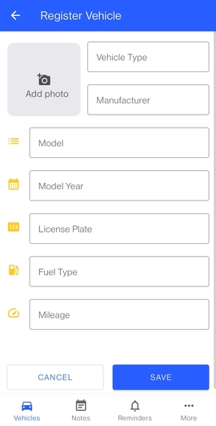
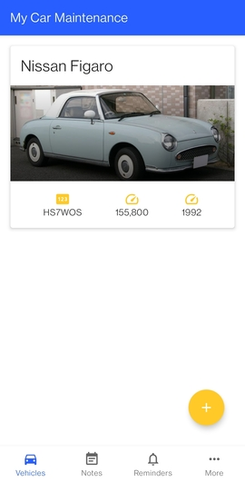
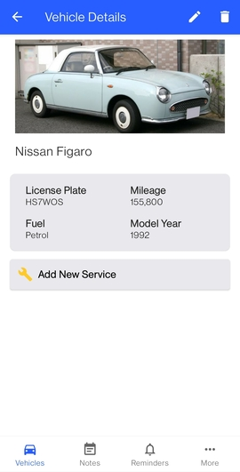
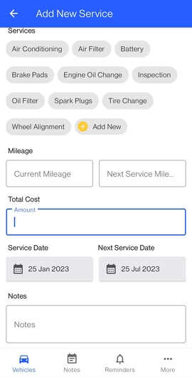
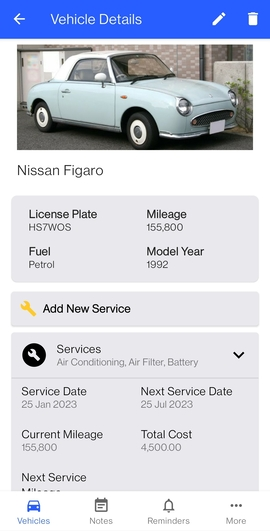

<h1 align="center"> Vehicle Managment</h1>  

  

  Keep track of your vehicle's maintenance and repairs.

<!-- START doctoc generated TOC please keep comment here to allow auto update -->
<!-- DON'T EDIT THIS SECTION, INSTEAD RE-RUN doctoc TO UPDATE -->

## Table of Contents

- [Introduction](#introduction)
- [Features](#features)
- [Feedback](#feedback)
- [Getting started](#getting-started)
- [License](#license)
- [Acknowledgements](#acknowledgements)

<!-- END doctoc generated TOC please keep comment here to allow auto update -->

## Introduction

Record information about maintenance and repairs done to vehicles. Built with Kotlin, Android Jetpack libraries, Gradle
and Android Studio.

**<a href="https://play.google.com/store/apps/details?id=com.pkndegwa.mycarmaintenance" target="_blank">Available on Google Play Store.</a>**

  

## Features

A few of the things you can do:

* Save details of vehicles you own
* Add service records as they happen
* Add reminders and notes

  
  
  
  
  
  
  

## Getting Started

1. Download the repository to your computer or use Git to clone it.
2. Open the project in Android Studio.
3. Build the project using Gradle.
4. Install the app on your device or run it in an emulator.

